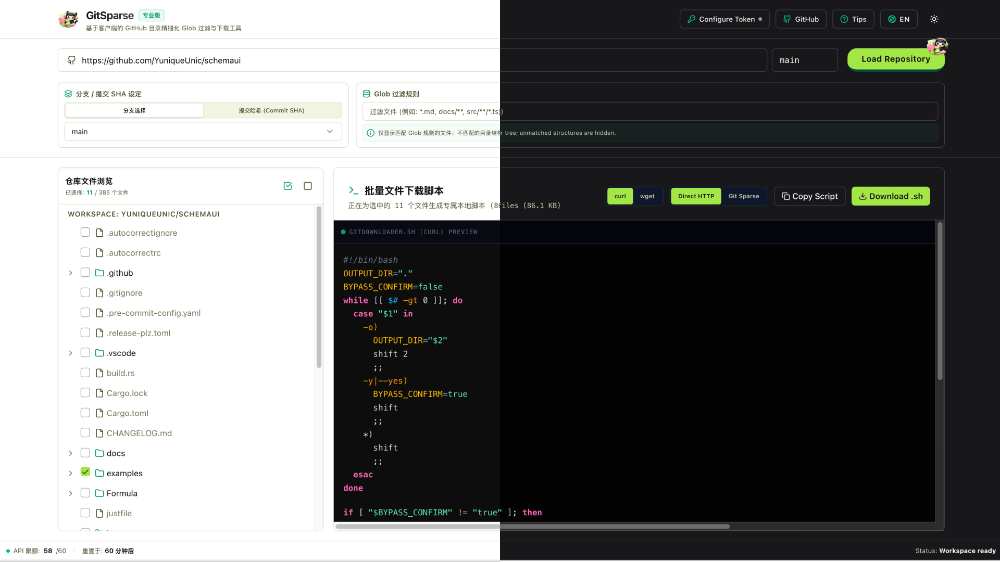

<div align="center" style="display: flex; justify-content: center; align-items: center; gap: 20px;">
  
  
</div>

<h2 align="center">
<a href="https://yuniqueunic.github.io/gitsparse/">Live Web</a>
| <a href="https://github.com/yuniqueunic/gitsparse">GitHub</a>
| <a href="./README.zh.md">中文</a>
</h2>

A 100% web client-side tool for granular selection, downloading, and shell script generation for GitHub repository directories and specific files.

<p align="center">
  
</p>

GitSparse leverages the GitHub REST API to rapidly parse repository tree structures directly in the browser. It features high-performance Glob pattern filtering and highlighting, allowing users to precisely select directories and files via an IDE-style tree interface. With a single click, it generates high-cohesion local Shell scripts containing `curl` commands, offloading the download and synchronization pressure of large repositories to your local terminal—saving significant bandwidth and disk space.

---

## Core Features

1. **Zero Server Overhead (100% Client-side)**: All logic and API requests are handled directly in the user's browser. This ensures lightning-fast performance and absolute privacy.
2. **Secure Access Token Management**: Users can configure a GitHub Personal Access Token, which is securely stored in `localStorage` to bypass GitHub API rate limits and access private repositories.
3. **IDE-Grade Indented File Tree**:
   * Folders feature complex checkbox logic, including **indeterminate**, selected, and unselected state synchronization.
   * File nodes display accurate sizes, and the tree is **elegantly collapsed by default** for clean performance.
4. **Glob Rule Highlighting & Tree Pruning**:
   * Powered by a 300ms intelligent debounce handler.
   * Automatically prunes the file tree to show and auto-expand only files matching Glob patterns, while highlighting matching nodes.
5. **Dual-Mode Download Engine**:
   * **Direct HTTP Mode**: Generates batch `curl` or `wget` scripts with custom output directories (`-o`), ideal for light tasks under 10 files.
   * **Git Sparse Mode**: Generates a high-performance shell script utilizing `git sparse-checkout` with a `blobless-filter` (`--filter=blob:none`), achieving up to 10x faster download speed on large monorepos.
6. **Smart Suggest Modal**: Automatically prompts the user to switch to high-performance Git Sparse Mode when selecting more than 10 files, with built-in "Don't show again" option.
7. **Session Auto-Restoration**: Securely persists states in local storage. Refreshing the browser instantly restores the previously loaded repository, branch, Commit SHA, Glob inputs, and all checkbox selection states, significantly easing rate-limiting issues.
8. **Interactive 3D UI & Locale Switcher**:
   * A beautiful, interactive 3D physics tactile button adorned with a bouncing, non-overlapping `w-10 z-[100]` cute project logo badge.
   * Zero-latency localized language switcher (supporting EN/ZH) featuring a spinning globe icon.
9. **Geeky Shell Parameters**: Generated shell scripts support a interactive y/N prompt, custom target paths, and a silent `-y`/`--yes` argument bypass.
10. **Cutting-Edge Tech Stack**: Built on Tailwind CSS v4, TypeScript 6, Vite 8, and React 19, delivering roughly 400ms production build times and extremely compact bundles.

---

## Technology Stack

* **Core Framework**: React 19 (Vite 8)
* **Language**: TypeScript 6
* **Styling**: Tailwind CSS v4 + PostCSS (@tailwindcss/postcss) + Lucide Icons
* **E2E Testing**: Playwright (with high-fidelity offline HTTP mocking)
* **Package Management**: Bun v1.3+

---

## 🚀 Quick Start

### 1. Environment Setup

We recommend using `Bun` as the default package manager for the fastest experience:

```bash
bun install

```

### 2. Start Development Server

The local development service will hot-start at `http://localhost:3000`:

```bash
bun run dev

```

### 3. Production Build

Vite will merge TypeScript and CSS in roughly **400ms**, generating a highly optimized production package in the `dist/` directory:

```bash
bun run build

```

### 4. Run E2E Automation Tests

The project includes high-fidelity Playwright test cases covering URL parsing, branch/SHA switching, Glob filtering, and script generation:

```bash
# Automatically starts the dev server and runs all E2E cases within seconds
bunx playwright test

```

---

## Quality Gates

Before submitting any changes, the following dual-gate requirements must be met:

1. **Type & Build Check**: Running `tsc && vite build` (or `bun run build`) must result in **0 errors and 0 warnings**.
2. **Automated Test Suite**: Running `playwright test` (or `bunx playwright test`) must achieve a **100% pass rate**.

## Links

* [Linux.do](https://linux.do)